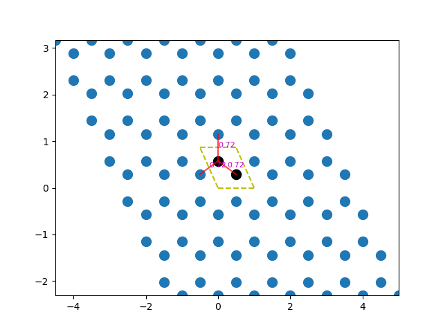
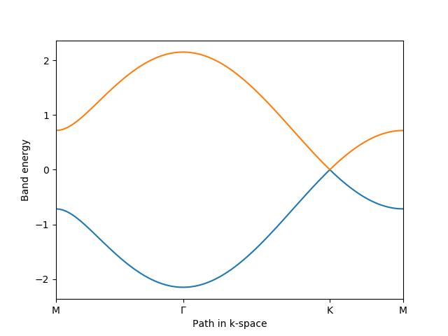

# MetaTB
> Tight binding models of super crystals with meta atoms

## Features
+ Build effective tight binding models according to symmetry group automatically

Build effective TB for P6mm

+ Calculate the bandstructure and analyze dispersion relationship automatically

Band-structure calculations

+ Build effective theoretial models for photonics/phononics meta atoms

## Status
Under development, not tested yet!

## E-mail
longyang_123@yeah.net  
You're most welcome to contact with me discuss any details about this project

## Extra
This project is highly basing on several opensource projects, i.e, PythTB.